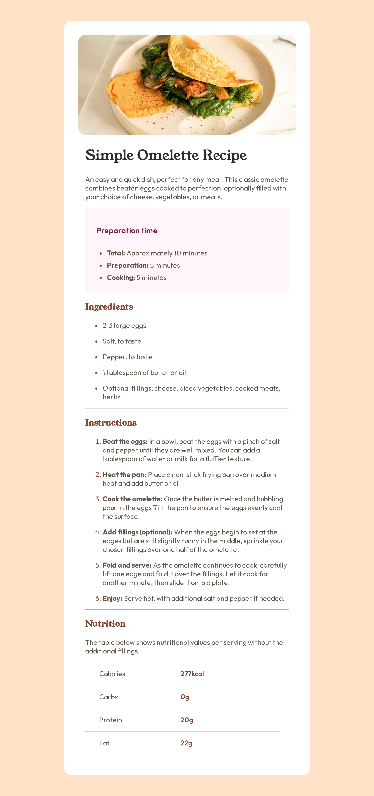

# Frontend Mentor - Recipe Page Solution

This is my solution to the [Recipe Page Challenge](https://www.frontendmentor.io/challenges/recipe-page-KiTsR8QQKm) on Frontend Mentor.
Frontend Mentor challenges help improve coding skills by building realistic projects using real-world UI designs.

---

## 📑 Table of Contents

* [Overview](#overview)

  * [The Challenge](#the-challenge)
  * [Screenshot](#screenshot)
  * [Links](#links)
* [My Process](#my-process)

  * [Built With](#built-with)
  * [What I Learned](#what-i-learned)
  * [Continued Development](#continued-development)
  * [Useful Resources](#useful-resources)
* [Author](#author)
* [Acknowledgments](#acknowledgments)

---

## 📌 Overview

### The Challenge

Users should be able to:

* View the optimal layout depending on their device screen size
* See a responsive recipe page layout similar to the provided design

---

### 📷 Screenshot



---

### 🔗 Links

* Solution URL: https://www.frontendmentor.io/profile/Shradha7070
* Live Site URL: https://omlette7070.netlify.app/

---

## ⚙️ My Process

### Built With

* HTML5 semantic markup
* CSS custom properties
* Flexbox
* Mobile-first workflow
* Media queries

---

### 💡 What I Learned

During this project, I learned:

* How to structure a webpage using **semantic HTML**
* How to apply **basic CSS styling**
* How to create **responsive layouts using media queries**
* How to work with **Markdown (.md) files for documentation**

Example of the media query used:

```css
@media (min-width: 768px) {
  body {
    background-color: #ffe3c9;
  }

  .main {
    max-width: 500px;
    margin: 48px auto;
    background-color: #ffffff;
    border-radius: 16px;
    padding: 32px;
  }

  .omlette-img {
    border-radius: 16px;
  }
}
```

---

### 🚀 Continued Development

Going forward, I want to improve my knowledge in:

* Flexbox layouts
* CSS Grid
* Responsive design techniques
* Writing more semantic and accessible HTML

---

### 📚 Useful Resources

* https://www.justinmind.com/web-design/responsive-website-examples
  This article helped me understand responsive web design better and see real-world examples of responsive websites.

---

## 👩‍💻 Author

* Frontend Mentor – https://www.frontendmentor.io/profile/Shradha7070
* X (Twitter) – https://x.com/shradha_7070

---

## 🙌 Acknowledgments

Thanks to Frontend Mentor for providing amazing frontend challenges that help beginners practice and improve their web development skills.
